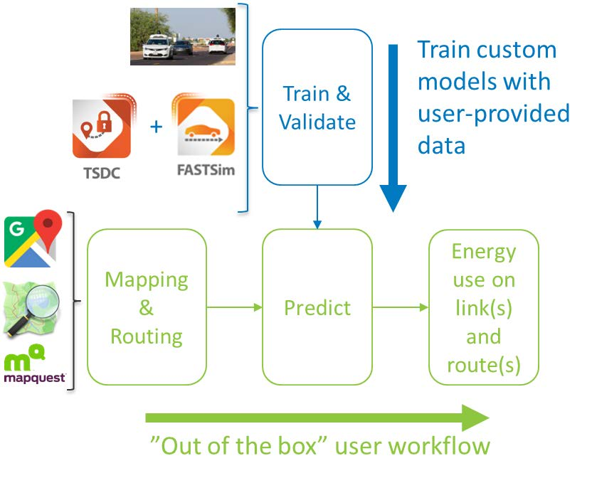

# RouteE

## Overview


The Route Energy Prediction Model (RouteE) was developed under ARPA-e TRANSNET and SMART Mobility - CAVs. Applications 
include vehicle route selection, energy accounting and optimization in transportation simulation, and corridor energy 
analyses, among others. This tool is applicable in any situation where past, present, or future trip information is 
available, and does not require high-resolution (i.e. 1 Hz+) like what is required to run a powertrain simulation. 
The simplest version of this model would be multiplying the average fuel economy of a vehicle by the distance of a 
proposed trip to get a prediction of fuel consumption. RouteE adds extensibility to account for different fuel 
consumption behavior based on traffic speed, road grade, stops, and turns. Validations have been performed using 
on-road fuel consumption data for conventional and electrified vehicle powertrains. Transferring the results of the 
on-road validation to a larger set of real-world origin–destination pairs, it is estimated that implementing the present 
methodology in a green-routing application would accurately select the route that consumes the least fuel 90% of the 
time. The novel machine learning techniques used in RouteE make it a flexible and robust tool for a variety of 
transportation applications.

RouteE is a modular and lightweight python package. The package allows for users to train and use custom vehicle energy 
consumption models or choose from the catalog of models pre-trained by NREL using 
[FASTSim](https://www.nrel.gov/transportation/fastsim.html) on over 1 million miles of driving data from the 
[Transportation Secure Data Center](https://www.nrel.gov/transportation/secure-transportation-data/).


## Setup
Clone (or download) the RouteE repository and create a compatible python environment to ensure package compatibility.

`git clone https://github.nrel.gov/MBAP/routee.git`


The `environment.yml` file is where the package dependencies reside. If you are using [conda](https://conda.io/docs/) 
as your package manager, simply run:
```
conda env create -f environment.yml
conda activate routee
```
This will create a new conda environment that is compatible with the routee project.

You can also install via pip:
```
pip install routee 
```

or if you're already in the routee root directory then: 

```
pip install .
```

Once the repo is cloned and environment created, you will be able to import the RouteE module within your code: 

```
import routee as rte
```

## Pre-Trained Models
The standard library of pretrained RouteE models is available on [Box](https://app.box.com/s/cwfqgkvxssoxnc4k6sghvqfjg19f4clb). From that link, you can download the standard library manually. It is recommended that you create a directory for the downloaded data by following these steps: 
```
cd <path-to-routee-powertrain>
mkdir powertrain/trained_models
```
Then move the downloaded and unzipped "standard" directory of pre-trained routee-powertrain models into ```powertrain/trained_models/```.

## Test Data
If you are developing on the routee-powertrain projects and plan to run any of the tests, you will need to also download the test data from [Box](https://app.box.com/s/dm5w4mo56ej9jfmyo404kz98roz7jat7). 

It is recommended that you move the downloaded and unzipped "routee-powertrain-test-data" directory into ```powertrain/tests/```.

## Getting Started

RouteE has two core functions: model training and energy prediction. The below image highlights RouteE's capabilities: 



The typical user will utilize RouteE's . Currently, the 
catalog consists of light-duty vehicle models, including conventional gasoline, diesel, plug-in hybrid electric (PHEV), 
hybrid electric (HEV), and battery electric (BEV). These models can be applied to link-level driving data (in the form 
of [pandas](https://pandas.pydata.org/) dataframes) to output energy consumption predictions. Such predictions can be 
applied to single-vehicle routes or network-wide traffic data.

Users that wish to train new RouteE models can do so. The model training function of RouteE enables users to use their 
own drive-cycle data, powertrain modeling system, and road network data to train custom models. 

This [routee-notebooks](https://github.nrel.gov/MBAP/routee-notebooks) repo provides demonstrations notebooks for 
examples of RouteE usage. The 
[demo notebook](https://github.nrel.gov/MBAP/routee-notebooks/blob/master/notebooks/demos/Use_Pretrained_Model.ipynb)
illustrating how to use the pre-trained RouteE models that ship with the package is particularly useful for getting up 
and running.


## Coming Soon*

* A RESTful API for using RouteE's prediction function.
* Medium- and Heavy-Duty vehicle modeling.
* Emissions estimation from the energy predictions.

<sub><sup>* "Soon"</sup></sub>

## Publications

* RouteE: A Vehicle Energy Consumption Prediction Engine (2020) ([link](https://saemobilus.sae.org/content/2020-01-0939)).
* Trip Energy Estimation Methodology and Model Based on Real-World Driving Data for Green-Routing Applications (2018) ([link](https://doi.org/10.1177/0361198118798286)).
* Development of a Trip Energy Estimation Model Using Real-World Global Positioning System Driving Data (2017) ([link](https://www.osti.gov/servlets/purl/1393793)).

## The Team

* Jake Holden (<jacob.holden@nrel.gov>)
* Nick Reinicke (<nicholas.reinicke@nrel.gov>)
* Jeff Cappellucci (<jeff.cappellucci@nrel.gov>)

## License
RouteE Copyright ©2019   Alliance for Sustainable Energy, LLC All Rights Reserved
 
This computer software was produced by Alliance for Sustainable Energy, LLC under Contract No. DE-AC36-08GO28308 with the U.S. Department of Energy. For 5 years from the date permission to assert copyright was obtained, the Government is granted for itself and others acting on its behalf a non-exclusive, paid-up, irrevocable worldwide license in this software to reproduce, prepare derivative works, and perform publicly and display publicly, by or on behalf of the Government. There is provision for the possible extension of the term of this license.
Subsequent to that period or any extension granted, the Government is granted for itself and others acting on its behalf a non-exclusive, paid-up, irrevocable worldwide license in this software to reproduce, prepare derivative works, distribute copies to the public, perform publicly and display publicly, and to permit others to do so. The specific term of the license can be identified by inquiry made to Alliance for Sustainable Energy, LLC or DOE. NEITHER ALLIANCE FOR SUSTAINABLE ENERGY, LLC, THE UNITED STATES NOR THE UNITED STATES DEPARTMENT OF ENERGY, NOR ANY OF THEIR EMPLOYEES, MAKES ANY WARRANTY, EXPRESS OR IMPLIED, OR ASSUMES ANY LEGAL LIABILITY OR RESPONSIBILITY FOR THE ACCURACY, COMPLETENESS, OR USEFULNESS OF ANY DATA, APPARATUS, PRODUCT, OR PROCESS DISCLOSED, OR REPRESENTS THAT ITS USE WOULD NOT INFRINGE PRIVATELY OWNED RIGHTS.
